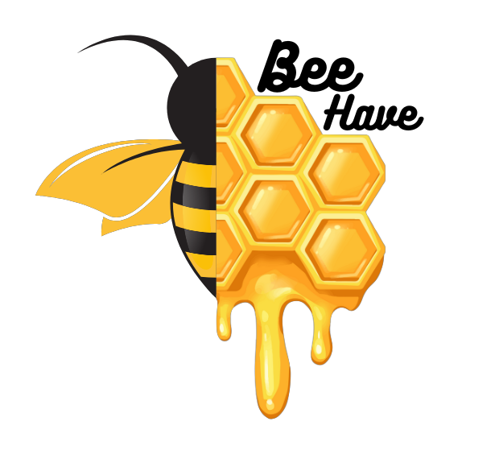

# BeeHave

  

  🐝🌼 Web Application built to support bees and beekepers 🌼🐝
   
  A project for
   
  Software Engineering and Software Project Management 
   
  courses of Computer Science at University of Salerno.

# Introduction

🐝 Web Application built with Python Flask with the purpose of helping beekepers grow their business and fight against the extinciont of bees. 

Produced for the Software Engineering and Software Project Management courses of Computer Science at University of Salerno.

## Authors

* **Gianmario Voria**       - *Project Manager*         - [gianwario](https://github.com/gianwario)
* **Antonio Della Porta**   - *Project Manager*         - [atdepo](https://github.com/atdepo)
* **Luigi Bacco**      - *Developer*         - [Luigi11162](https://github.com/Luigi11162)
* **Thomas De Palma**      - *Developer*         - [andesrule](https://github.com/andesrule)
* **Maria Lucia Fede**         - *Developer*         - [MariaLuciaFede01](https://github.com/MariaLuciaFede01)
* **Irene Gaita**       - *Developer*         - [IreneGaita](https://github.com/IreneGaita)
* **Gianluca Ronga**        - *Developer*         - [GameWame](https://github.com/GameWame)

## Documentation

* The whole documentation of the project can be found in the *Documents* directory

# Technical informations

In this section we introduce technical informations and installing guides!

## Clone and run the project locally

Follow these steps:

1. Clone this repository locally;
2. Create a virtual environment and install the libraries contained in the "requirements.txt" file;
3. Install MySQL locally and setup the root user with "root" password;
4. Run the "main.py" file and open the web application available at the URL "http://localhost:5000"

## Built With

* [Python](https://www.python.org/) - The programming language used for the back-end development.
* [Flask](https://flask.palletsprojects.com/en/2.2.x/) - The framework used to build and develop the web application.
* [HTML5](https://www.w3schools.com/html/default.asp) - Used for the front-end development.
* [Bootstrap](https://getboostrap.com/) - Front-end framework.

# Contributors

